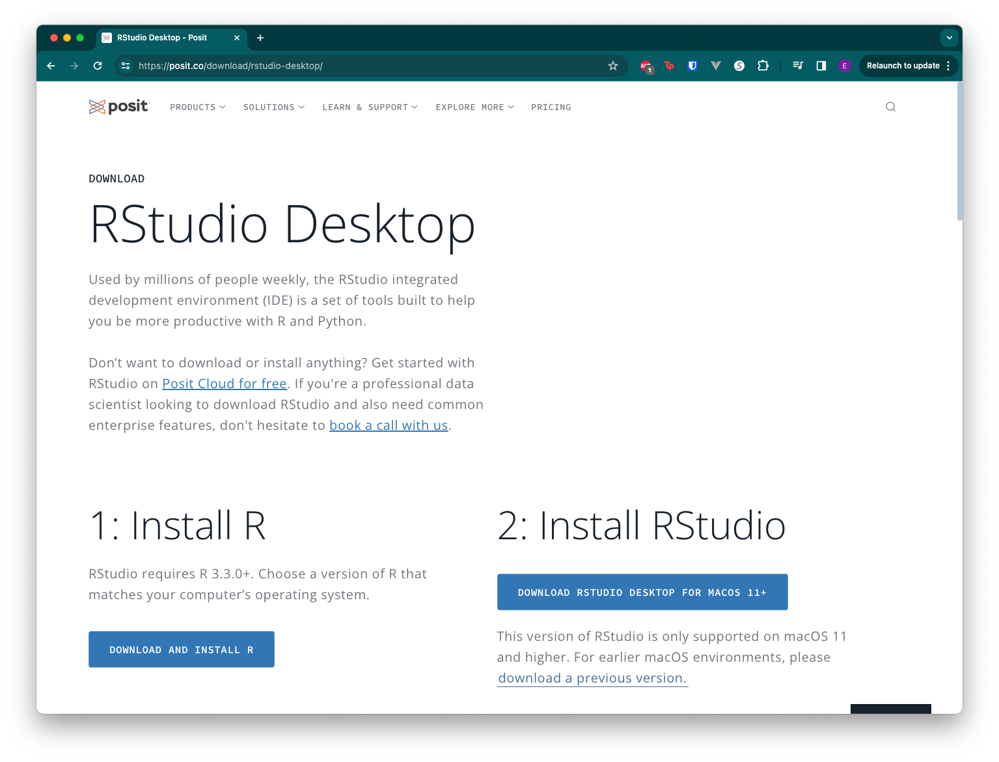
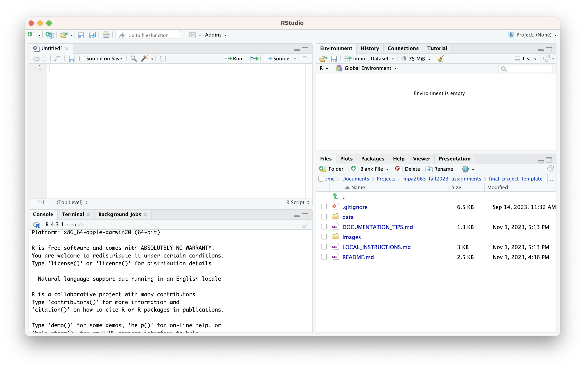

# Setting Up Your Local Environment

## Install R and IDE
1. Navigate to [R-Studio](https://posit.co/download/rstudio-desktop/) then click `Download and Install R`. 

2. Install an integrated development environment (IDE)s. You can install **R Studio** at the same site. Alternatively,
you can install [VSCode](https://code.visualstudio.com/) as another popular option. Feel free to use whichever IDE you'd
like.

## Install Git

### Download Git

| Operating System | Instructions | Notes |
| --- | --- | --- |
| Max OS | [Download for macOS](https://git-scm.com/download/mac) | I'd recommend installing [homebrew](https://brew.sh/) then installing git |
| Windows | [Download for Windows](https://git-scm.com/download/win) | I think this also installs git bash |

### Generate a new SSH key to add to Github

1. Open Terminal (MacOS) or Git Bash (Windows)
2. Paste the text below, replace the email with your email.
```shell
ssh-keygen -t rsa -b 4096 -C "your_email@example.com"
``` 
This creates a new SSH key. When you're prompted to "Enter a file in which to save the key", you can press **Enter** to
accept the default file location.

3. Feel free to press **Enter** for the following prompts.
```shell
> Enter passphrase (empty for no passphrase): [Type a passphrase]
> Enter same passphrase again: [Type passphrase again]
```

4. Follow [these instructions](https://docs.github.com/en/github-ae@latest/authentication/connecting-to-github-with-ssh/adding-a-new-ssh-key-to-your-github-account#adding-a-new-ssh-key-to-your-account)
to add a new SSH key to your Github Account.

### Clone the Repository

Same process as we have been doing for all the projects ! 

Click **Code** then copy the SSH link. In your terminal (macOS)
or Git Bash (windows), navigate to where you want to put your repository, then run `git clone <your SSH url>`.


### Working in RStudio (optional)
At this point, you can use RStudio or your IDE of choice! 



### Using JupyterLab Locally (optional)

**Installing JupyterLab**

1. [Installing JupyterLab Official Instructions](https://jupyterlab.readthedocs.io/en/stable/getting_started/installation.html)
  - :bulb: If you installed homebrew (MacOS) earlier you can just run `brew install jupyterlab` in your terminal !
  - :see_no_evil: Not sure what to do for windows... see official instructions.

**Add the R Kernel to Jupyter Lab**
1. Open an R console
  - *MacOS* - Open a terminal, type `R` and enter to open an R console. Or open RStudio and there is an R console at the bottom.
  - *Windows* - Open RStudio, the R console is at the bottom.
2. Install Packages. Copy the following in the R console.
```R
install.packages('IRkernel')
```
3. Make the kernel available to Jupyter to the current user
```R
IRkernel::installspec()
```

**Starting JupyterLab**
1. [Starting JupyterLab Official Instructions](https://jupyterlab.readthedocs.io/en/stable/getting_started/starting.html)

In your terminal you can run the following line. I'd recommend navigating to your project directory first in the terminal.
```shell
jupyter lab
```
