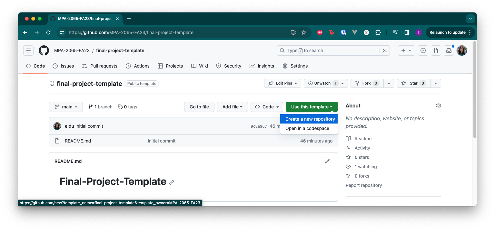
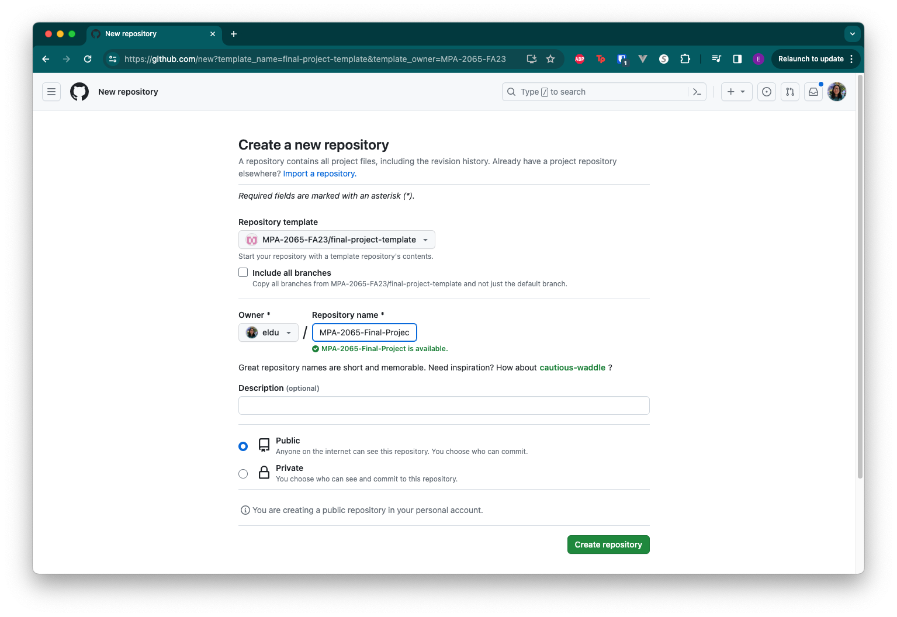
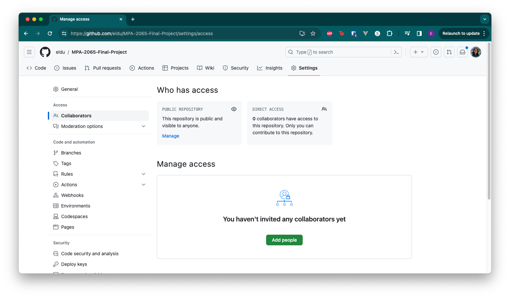
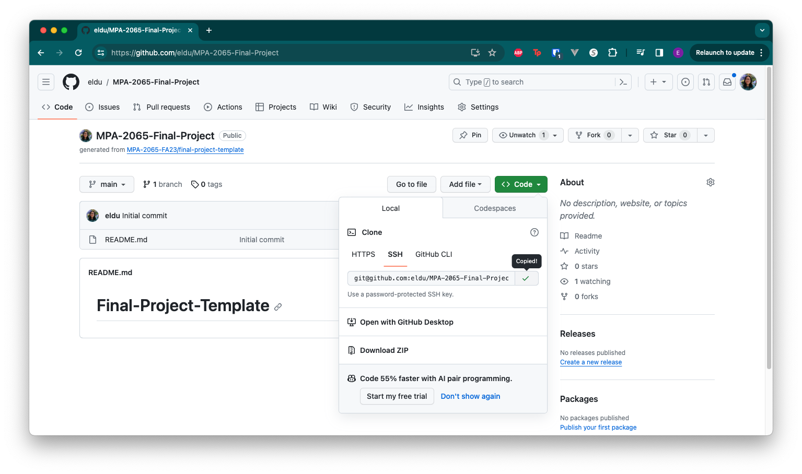
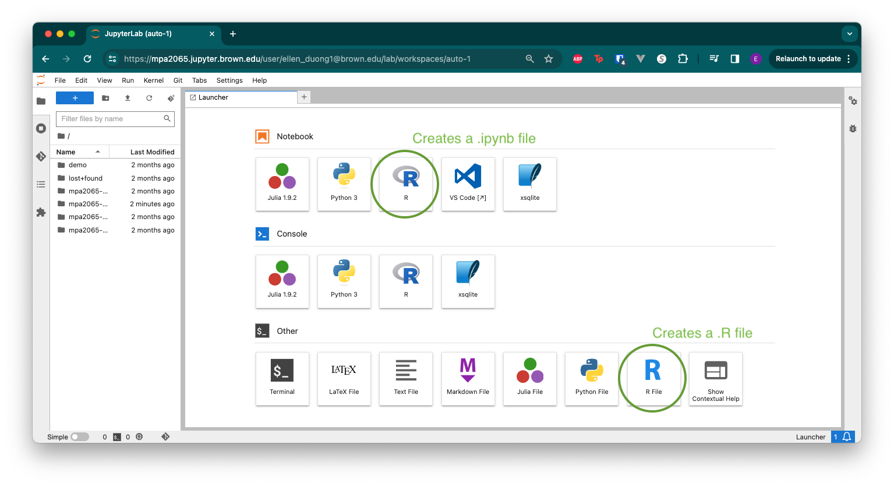

# Final Project Template

This template is a starting point for your final project if you want to work on it in JupyterHub or on your local
computer.

Feel free to edit anything and everything in this repository because this is your project. Rewrite this README to be
about your project!

## Setup Instructions

### Create your repository from this template
1. Use this template. Click `Use this template` then `Create new repository`. This will create a new copy of this
repository

2. Fill out details of new repository. Add yourself as the **Owner**. Then add a name for the repository, for example 
`MPA-2065-final-project`. Keep the repository as **public** so I'll be able to see it. Otherwise, you could set it to 
**private** and add me as a collaborator. You'll be able to add your group members as collaborators to the repository 
later.

3. Add collaborators. Under your repository name on the right, click **Settings**. Then in the left sidebar, click 
**Collaborators**. Then click **Add people**. Then, 

Further instructions [Managing teams and people with access to your repository](https://docs.github.com/en/repositories/managing-your-repositorys-settings-and-features/managing-repository-settings/managing-teams-and-people-with-access-to-your-repository)

### Clone your repository
Now, you and your teammates are able to clone the repository and work on it! And it's the same process as we have been 
doing for all the projects !

:rotating_light: :warning: If you're planning on working on this on your local computer, skip to the 
[Local Computer](#local-computer) section below.

Click **Code** then copy the SSH link. In your terminal (macOS)
or Git Bash (windows), navigate to where you want to put your repository, then run `git clone <your SSH url>`.

#### JupyterHub

:bulb: In the JupyterHub launcher you can create notebooks `.ipynb` files and R files.

:rotating_light: :warning: Merge conflicts for `.ipynb` are difficult to clear up. I'd suggest pair-programming on the 
same account.

#### Local Computer

:star: There are additional set up instructions if you'd like to work on your local computer. Navigate to the
[LOCAL_INSTRUCTIONS](LOCAL_INSTRUCTIONS.md) file.

## Additional Resources
- [Getting Started with Markdown](https://www.markdownguide.org/getting-started/)
- [Getting Started creating a README](https://readme.so/)
- [Oh Sh*t, Git?!](https://ohshitgit.com/)
- [Git Merge Conflicts Tutorial](https://www.atlassian.com/git/tutorials/using-branches/merge-conflicts)
- [Data Science Training](https://gist.github.com/hadley/820f09ded347c62c2864)